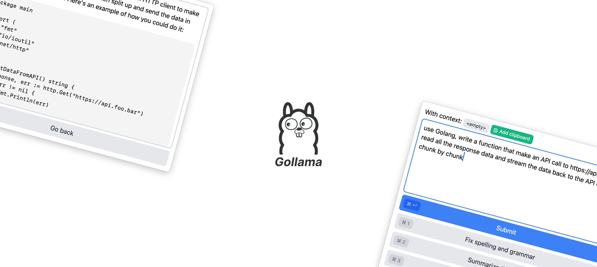

# Gollama

<p align="center">
    
</p>
<p align="center">An AI sidekick that run on your own machine.</p>

---

## Introduction

Gollama is a GUI application that allows you to quickly interact with OpenAI-compatible LLM API (like Ollama, OpenAI GPT,...).

## Installation

Currently, there is no prebuilt binary, so you have to build the app on your own machine.

You will need to install Go (1.18 or newer) and [Wails CLI](https://wails.io/).

Clone the repository:

```
$ git clone https://github.com/huytd/gollama
$ cd gollama
```

And run the build command:

```
$ wails build
```

The `gollama.app` will be created in the `./build/bin` folder. Copy it anywhere to run.

## How to use

You have two options to use Gollama: With OpenAI API or with Ollama.

### Option 1: Use Gollama with Ollama's API

First, install and run Ollama (https://ollama.com/) on your machine. Then config the Gollama with the following information:

- API URL: http://localhost:11343/v1
- API Key: ollama
- API Model: whatever model you have with Ollama, for example, `mistral:latest`

### Option 2: Use Gollama with OpenAI's API

You will need to have the [OpenAI API key](https://help.openai.com/en/articles/4936850-where-do-i-find-my-openai-api-key). Config Gollama with the following information:

- API URL: https://api.openai.com/v1
- API Key: Your OpenAI API key
- API Model: gpt-3.5-turbo or whatever model you have access to
